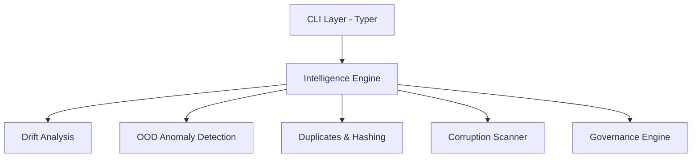

<div align="center">
  
  
  # DatasetVision 👁️
  
  **Industry-Grade Dataset Governance & Drift Intelligence CLI for Computer Vision**

  [](https://www.python.org/downloads/)
  [](https://opensource.org/licenses/MIT)
  []()
  [](https://github.com/psf/black)
</div>

---

## 🚀 Overview

**DatasetVision** is a robust, production-ready CLI engineered to enforce strict data governance, detect dataset drift, and monitor data health for computer vision workflows. Catch data anomalies *before* your model decays.

Whether you're battling **label noise**, **near-duplicates**, or **semantic shifts** in production datasets, DatasetVision provides lightning-fast intelligence layers to validate your data pipelines deterministically.

---

## ✨ Enterprise-Grade Features

- 🛡️ **Anomaly Detection Layer**  
  Detect anomalous and out-of-distribution images using deep cv2 feature embeddings and Z-score outlier analysis.
- 📉 **Data Drift Intelligence**  
  Compare two datasets and accurately quantify semantic drift using Centroid Distance Tracking and Class Anomaly Tracking.
- 🔍 **Dataset Scanner**  
  Automatically flag corrupted files, purely blank images, and completely extreme aspect ratios.
- 👯 **Duplicate Hunter**  
  Locate exact duplicates (via MD5 hashing) and near-duplicates (via Perceptual Hashing & Hamming Distances) safely.
- 📋 **Governance Check**  
  Enforce rules on class imbalance and label noise immediately with strict CI/CD pipeline compatibility.
- 📊 **HTML Reports**  
  Export automated, fully shareable visual reports of your dataset's structural health locally.

---

## 📦 Installation

DatasetVision requires **Python 3.10+**. 

```bash
# Clone the repository
git clone https://github.com/nibir-ai/datasetvision.git
cd datasetvision

# Install via pip
pip install -e .
```

*To install development dependencies (for testing):*
```bash
pip install -e '.[dev]'
```

---

## ⚡ Quickstart Guide

DatasetVision provides several intuitive CLI commands powered by `typer`.

### 1. Generate Intelligence & Enforce Policy
Analyze your dataset's health, anomalies, and verify it passes governance rules:
```bash
datasetvision intelligence /path/to/dataset
```

### 2. Compare Datasets (Drift Analysis)
Evaluate domain or semantic drift between a `source` and `target` dataset:
```bash
datasetvision drift /path/to/old_data /path/to/new_data
```

### 3. Scan Dataset for Corruption
Find blank, corrupt, or fundamentally broken images instantly:
```bash
datasetvision scan /path/to/dataset --output report.json
```

### 4. Find Duplicates
Discover redundant data dragging down your model training speed:
```bash
# Find near duplicates using Perceptual Hashing
datasetvision duplicates /path/to/dataset --near

# Find exact duplicates using MD5
datasetvision duplicates /path/to/dataset --exact
```

### 5. Generate Visual HTML Report
Export the intelligence findings to a static, self-contained HTML file:
```bash
datasetvision report /path/to/dataset output_report.html
```

---

## 🏗️ Architecture



---

## 🤝 Contributing

We welcome pull requests! For major changes, please open an issue first to discuss what you would like to change.

1. Fork the repo.
2. Create your feature branch (`git checkout -b feature/AmazingFeature`).
3. Commit your changes (`git commit -m 'Add some AmazingFeature'`).
4. Ensure tests pass (`pytest tests/`).
5. Push to the branch (`git push origin feature/AmazingFeature`).
6. Open a Pull Request.

---

<div align="center">
  <i>Maintained with ❤️ by Nibir Biswas</i>
</div>
